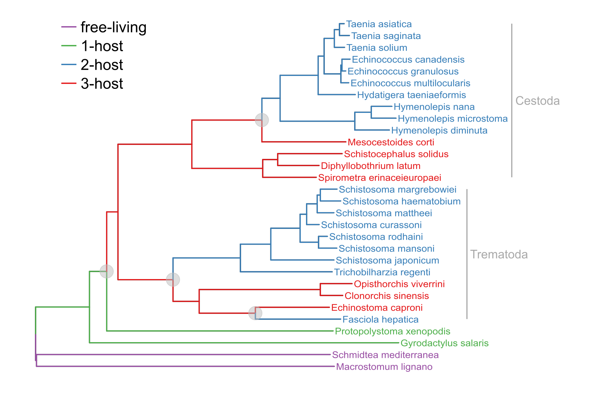

## Helminth genomes and life cycle transitions

A number of parasitic worms, helminths, have had their genomes sequenced. Most of these genomes are housed at [WormBase Parasite](https://parasite.wormbase.org/index.html). The scripts in this repository access some of the genomic data via the wormbase API, specifically orthologs that are mostly single-copy. The retrieved genes are then used to build phylogenetic trees on to which ancestral life cycle states can be mapped.

